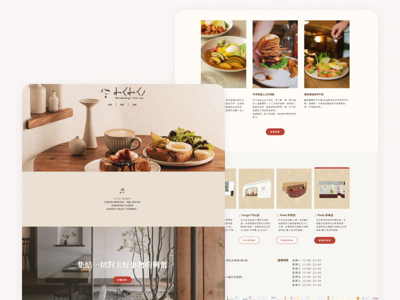

# waku-waku

## [Live Site](https://gretali.github.io/wakuwaku) | [Code](https://github.com/GretaLi/wakuwaku)

# 專案簡介

重新設計一個一頁式餐廳網站，讓潛在客戶能夠輕鬆找到店家的資訊和菜單，同時保留日式洋食餐廳的特色。

# **使用技術**

### **前期規劃**

- [Figma](https://https//www.figma.com/)  設計風格和安排網站動線規劃

### **中期開發**

- HTML、SCSS、Javascript
- SCSS 管理樣式
- **[Owl Carousel](https://owlcarousel2.github.io/OwlCarousel2/)** 製作輪撥效果
- **[AOS](https://michalsnik.github.io/aos/)** 製作頁面動畫

### **後期部屬**

- [Github](https://github.com/)  部屬網站
